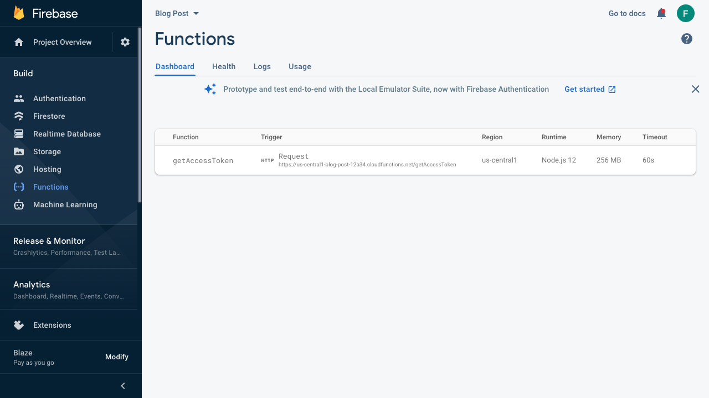

# Use Firebase Functions as authentication service

This blog post will show you how to use the Google Firebase Functions to build an authentication service for the Dolby.io SDK. We, at Dolby.io, consistently think about security and how to help our customers building applications and services that are following [security best practices](https://dolby.io/developers/interactivity-apis/guides/security-best-practices). As an example, we recently introduced the [Enhanced Conference Access Control](https://dolby.io/developers/interactivity-apis/guides/enhanced-conference-access-control) capability that allows you to set permissions for your users joining conferences.

## Introduction

In this post post I want to focus on the initialization of the SDK in your applications. In the past, when you wanted to create an application that requires no backend to work, it was quite difficult to avoid hardcoding the Consumer Key and Consumer Secret. There are a few problems there. If your key and secret are hardcoded into your applications, you can consider that anyone (with a minimum of knowledge) can capture them, by either decompiling your application or by listening to the traffic going through the authentication endpoint. Now, let say you need to use a new key for your applications, you will need to build a new version of your application and have all of your users to upgrade at the same time if you want them to be able to communicate with each other (You cannot join a conference created with another consumer key). This is not practical for many users.

To avoid this, we recommend our customers to use a backend with a protected endpoint that will allow to generate an access token that can be used by your applications to initialize the SDK. But creating and maintaining a server for only this endpoint can become very expensive and time consuming, as you need to make sure it scales with the load of your application, you need failover, you need to update the server with the latest patch updates... This is 2021 and all the major cloud providers are now offering a serverless service; [Azure Functions](https://azure.microsoft.com/en-us/services/functions/), [AWS Lambda](https://aws.amazon.com/lambda/) and [Google Cloud Functions](https://cloud.google.com/functions). The advantage of running a cloud function for this kind of workload is that you do not have to maintain a server, you do not have to worry about scaling and the cost is minimal.

We are going to deploy a **Firebase Functions** that we will use to generate an access token to initialize the SDK. [Firebase Functions](https://firebase.google.com/docs/functions) are built on top of the Google Cloud function. As of writing this post, Google Cloud does not charge for the first two million execution for your function (see the [pricing](https://firebase.google.com/pricing) page for more details). Note that the Google Cloud Functions are running from containers and there is a cost associated with hosting a container registry.

## Firebase Function

Install the Firebase Tools on your machine using the following `npm` command ([Node.JS](https://nodejs.org/)):

```bash
npm install -g firebase-tools
```

Log the CLI into Firebase:

```bash
firebase login
```

Create a folder where you want to have your code and initialize your project with the command:

```bash
firebase init
```

You will be asked what you want to set up in this folder, select *Functions: Configure and deploy Cloud Functions*. If you already have a Firebase project, select *Use an existing project*. Select the language you want to use to write the Cloud Function. I will provide you the code in [TypeScript](https://www.typescriptlang.org/). Use [ESLint](https://eslint.org/) to have a clean TypeScript code, then install the dependencies with NPM.

Open the file `functions/src/index.ts`. This will be the code of your function. Replace the content with the following code. Make sure to replace your *CONSUMER_KEY* and *CONSUMER_SECRET*. You can go one step further if you want to protect these by using the [Secret Manager](https://cloud.google.com/secret-manager) from Google Cloud.

```typescript
import * as functions from "firebase-functions";
import * as http from "http";
import * as https from "https";

// Enter your Consumer Key and Secret from the dolby.io dashboard
const CONSUMER_KEY = "CONSUMER_KEY";
const CONSUMER_SECRET = "CONSUMER_SECRET";

/**
 * Sends a POST request
 * @param {string} hostname
 * @param {string} path
 * @param {OutgoingHttpHeaders} headers
 * @param {string} body
 * @return {Promise<any>} A JSON payload object through a Promise.
 */
const postAsync = (hostname: string, path: string, headers: http.OutgoingHttpHeaders, body: string): Promise<any> => {
  return new Promise(function(resolve, reject) {
    const options: https.RequestOptions = {
      hostname: hostname,
      port: 443,
      path: path,
      method: "POST",
      headers: headers,
    };

    const req = https.request(options, (res) => {
      functions.logger.debug(`[POST] ${res.statusCode} - https://${hostname}${path}`);

      let data = "";
      res.on("data", (chunk) => {
        data = data + chunk.toString();
      });

      res.on("end", () => {
        const json = JSON.parse(data);
        resolve(json);
      });
    });

    req.on("error", (error) => {
      functions.logger.error(error);
      reject(error);
    });

    req.write(body);
    req.end();
  });
};

/**
 * Gets a JWT token for authorization.
 * @param {string} hostname
 * @param {string} path
 * @return {Promise<any>} a JWT token.
 */
const getAccessTokenAsync = (hostname: string, path: string): Promise<any> => {
  const body = "grant_type=client_credentials";

  const authz = Buffer.from(`${CONSUMER_KEY}:${CONSUMER_SECRET}`).toString("base64");

  const headers = {
    "Content-Type": "application/x-www-form-urlencoded",
    "Cache-Control": "no-cache",
    "Authorization": "Basic " + authz,
    "Content-Length": body.length,
  };

  return postAsync(hostname, path, headers, body);
};

export const getAccessToken = functions.https.onCall((_data, _context) => {
  // See: https://dolby.io/developers/interactivity-apis/reference/rest-apis/authentication#operation/postOAuthToken
  return getAccessTokenAsync("session.voxeet.com", "/v1/oauth2/token");
});
```

> Download the [source code](src/) of this Firebase Function.

Deploy this function to your Firebase project:
```bash
firebase deploy
```

Log into the [Firebase Dashboard](https://console.firebase.google.com/), navigate to your Firebase project and select the Functions in the Build menu.



After a few seconds you will see your `getAccessToken` function.

> **Note:** the *Memory* is set to 256 MB automatically. Since the code is really small, you should be able to run it with only 128 MB. You can also lower the *timeout*. To change that, go to the Google Cloud console and update the function.

And that was it, we have deployed an authentication service using a serverless service on Google Cloud. Now, we need to modify our applications to leverage this authentication service and remove, once and for all, the Consumer Key and Secret from the source code of your applications. This method of initialization will be deprecated in a future release of the SDKs across all platforms.

## Android implementation

The following code is based on the [voxeet-sdk-android-gettingstarted](https://github.com/voxeet/voxeet-sdk-android-gettingstarted) GitHub repository.

In the file `build.gradle`, add the following *classpath* in the dependencies of the *buildscript* section:

```gradle
classpath 'com.google.gms:google-services:4.3.5'
```

In the file `app/build.gradle`, add the following dependencies:

```gradle
// Import the BoM for the Firebase platform
implementation platform('com.google.firebase:firebase-bom:26.8.0')

// Declare the dependencies for the Firebase libraries
// When using the BoM, you don't specify versions in Firebase library dependencies
implementation 'com.google.firebase:firebase-analytics'
implementation 'com.google.firebase:firebase-functions'
```

Download the file `google-services.json` from your Firebase dashboard and move it to the `app` folder of your Android project.

In your `MainActivity.java` file, add the following imports:

```java
import com.google.android.gms.tasks.OnCompleteListener;
import com.google.android.gms.tasks.Task;
import com.google.firebase.functions.FirebaseFunctions;
import com.google.firebase.functions.HttpsCallableResult;

import java.util.HashMap;
```

Create the following variable in the MainActivity class.

```java
private FirebaseFunctions mFunctions;
```

Create the function that will request the Access Token from the *getAccessToken** Firebase Function.

```java
/**
 * Get an Access Token from the Firebase Function.
 */
private Task<String> getAccessToken() {
    return mFunctions
            .getHttpsCallable("getAccessToken")
            .call()
            .continueWith(task -> {
                HttpsCallableResult result = task.getResult();
                HashMap<String, String> json = (HashMap<String, String>) result.getData();
                return json.get("access_token");
            });
}
```

In the `onCreate(Bundle savedInstanceState)` method, initialize the `mFunctions` variable, remove the deprecated `initialize` method and request an access token from Firebase Function to initialize the SDK.

```java
mFunctions = FirebaseFunctions.getInstance();

// throw new IllegalStateException("<---- Remove this line and set your keys below to use this sample !!");
// VoxeetSDK.initialize("", "");

getAccessToken()
        .addOnSuccessListener(accessToken -> {
            // Initialize the SDK with the Access Token
            VoxeetSDK.initialize(accessToken, (isExpired, callback) -> {
                // When the callback is triggered, request a new access token
                getAccessToken()
                        .addOnSuccessListener(refreshToken -> {
                            callback.ok(refreshToken);
                        })
                        .addOnFailureListener(error -> {
                            error.printStackTrace();
                            callback.error(error);
                        });
            });
        })
        .addOnFailureListener(error -> {
            error.printStackTrace();
        });
```

That's it, the Android application is now using the Firebase Function to request an access token and initialize the SDK.

## iOS implementation

## JavaScript implementation
